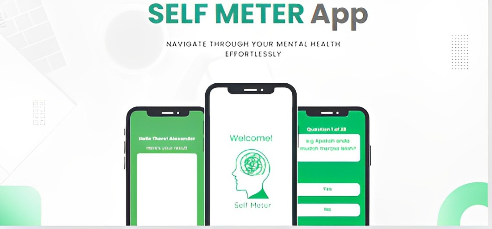

# Self Meter

Our project addresses the widespread issue of untreated mental health conditions which impact well-being, productivity, and social relationships, due to stigma, limited resources, and lack of awareness, by leveraging digital technology for accessible and scalable support.

## Main Features

Users can complete a mental health questionnaire. Based on the results, the application generates graphs depicting various mental health disorders, including depression, anxiety, stress, and sleep disorders. These graphs help users track their conditions over time and identify patterns. Personalized suggestions are then provided to help manage and improve mental wellbeing.

## Installation

To install this app, follow these steps:

1. Download the APK file from [app download link](link-to-apk).
2. Open the APK file on your Android device.
3. Follow the on-screen installation instructions.

## Our Team

| Name                               | University                        | Learning Path | LinkedIn                         |
| ---------------------------------- | --------------------------------- | ------------- | -------------------------------- |
| Daffa Maajid Augustinov Purwanto   | Universitas Gunadarma             | MD            | [LinkedIn](https://www.linkedin.com/in/daffamaajid/)                          |   
| Satyo Tri Hanggoro                 | Universitas Gunadarma             | CC            | [LinkedIn](https://www.linkedin.com/in/satyo-tri-hanggoro-a46a88227/)                    |
| Aji Maulana                        | Politeknik Pratama Mulia          | CC            | [LinkedIn](https://www.linkedin.com/in/aji-maulana-0bb20921b)                    |
| Seva Nonda Farkhan Syah            | Universitas Gunadarma             | ML            | [LinkedIn](https://www.linkedin.com/in/seva-nonda-farkhan-syah-0ab311247/)                    |
| Zahra Areefa Ananta                | Institut Teknologi Sumatera       | ML            | [LinkedIn](https://www.linkedin.com/in/zahra-areefa-ananta-28566124b/)                    |
| Bani Adam Tampubolon               | Institut Teknologi Sumatera       | ML            | [LinkedIn](https://www.linkedin.com/in/baniadamtampubolon)                    |

## Resource
|  Learning Path                | Branch                               |
|------------------------------ |--------|
| Cloud-Computing               | [CC](https://github.com/SatyoTri/Self-Meter/tree/Cloud-Computing) |
| Mobile Development            | [MD](https://github.com/SatyoTri/Self-Meter/tree/mobile-development) |
| Machine-learning              | [ML](https://github.com/SatyoTri/Self-Meter/tree/Machine-Learning) |

